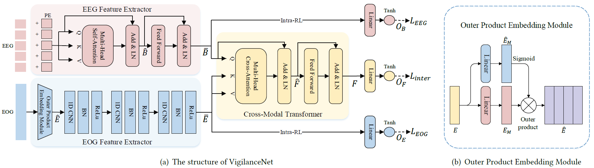
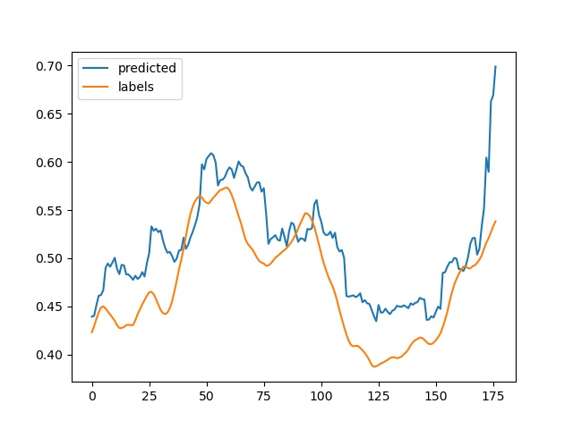

# VigilanceNet

Code for the ACM MM 2022 paper: "VigilanceNet: Decouple Intra- and Inter-Modality Learning for Multimodal Vigilance Estimation in RSVP-Based BCI"

---


VigilanceNet is a multimodal method to estimate vigilance levels using electroencephalography (EEG) and electrooculogram (EOG). We propose to decouple the learning of intra- and inter-modality to improve multimodal learning (as Fig. (a)). Specifically, for intra-modality, we introduce an intra-modality representation learning (intra-RL) method to obtain effective representations of each modality by letting each modality independently predict vigilance levels during the multimodal training process. For inter-modality, we employ the cross-modal Transformer based on cross-attention to capture the complementary information between EEG and EOG, which only pays attention to the inter-modality relations. In addition, we design an outer product embedding module to extract the multiplicative relationships between EOG features (as Fig. (b)). We welcome you to read our paper for more details!

## Install
```bash
pip install -r requirements.txt
```

### Datasets
We used publicly available [SEED-VIG dataset](https://iopscience.iop.org/article/10.1088/1741-2552/aa5a98/meta?casa_token=zMmqflOHEYYAAAAA:F7YusFzBVULbjWBmoy39cvGI9RPMrUrDIOF_s1azdKrH1L0KJW9Cw_NuqFspM5OsRjMpECCpwtne).
We include a small piece of data from SEED-VIG in the folder `./data/` as a sample. The `train_data.mat` and `test_data.mat` files have three keys as follows.
>- `eeg`: differential entropy (DE) from five frequency bands: delta (1–4 Hz), theta (4–8 Hz), alpha (8–14 Hz), beta (14–31 Hz), and gamma (31–50 Hz). The data format of the sample data is sample_number\*channel\*frequency_bands (N\*17\*5).
>- `eog`: EOG features are extracted from VEO and HEO. The data format of the sample data is sample_number\*feature_dimension (N\*36).
>- `labels`: continuous vigilance labels PERCLOS calculated from eye tracking data. The data format of the sample data is sample_number\*1 (N\*1).


## Train
```bash
python train.py
output > 
Finished training
```


## Evaluation
```bash
python test.py
output > This script will generate 'result.jpg' which shows the continuous curves of PERCLOS labels and the corresponding predictions.
rmse:  0.04764215499440987
corr:  0.8560710833595215
```

